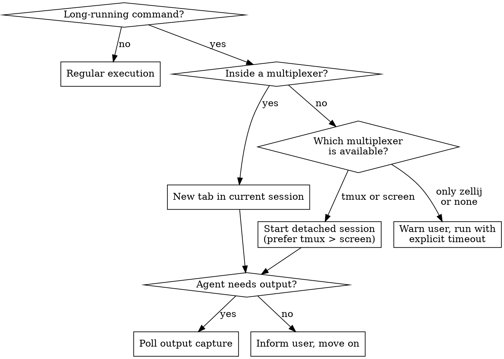

# Long-Running Commands

## Overview

Detect the terminal multiplexer and dispatch long-running commands there instead of blocking the agent's execution tool.

## When to Use



## Known Long-Running Patterns

Match the command against these categories before executing:

### Indefinite (never self-terminates)

| Category | Example commands |
|----------|-----------------|
| Dev servers | `npm start`, `npm run dev`, `yarn dev`, `pnpm dev`, `uvicorn`, `flask run`, `gunicorn`, `rails server`, `php artisan serve`, `cargo run` (server binaries) |
| File watchers | `nodemon`, `watchman-wait`, `inotifywait -m`, `fswatch`, `entr`, `cargo watch` |
| Log tails | `tail -f`, `journalctl -f`, `docker logs -f`, `kubectl logs -f`, `less +F` |
| Interactive TUIs | `htop`, `top`, `btop`, `k9s`, `lazygit`, `tig` |

### Extended (terminates eventually, but may exceed tool timeout)

| Category | Example commands |
|----------|-----------------|
| Large builds | `cargo build`, `make -j`, `gradle build`, `nix build`, `nix-build`, `bazel build` |
| Full test suites | `pytest` (large), `cargo test`, `go test ./...`, `mvn test` |
| Container builds | `docker build`, `podman build` |
| Package installs | `npm install` (large), `pip install` (compiling), `cargo install` |

**Heuristic:** If the command contains a known indefinite pattern, always dispatch. For extended patterns, dispatch when the project is known to be large or the command is expected to run beyond the tool's timeout.

## Multiplexer Detection

Run these checks before dispatching. Order matters — check "inside" first to avoid nesting.

### Step 1: Am I inside a multiplexer already?

| Multiplexer | Check | How |
|-------------|-------|-----|
| tmux | `$TMUX` is set | `test -n "$TMUX"` |
| screen | `$STY` is set | `test -n "$STY"` |
| zellij | `$ZELLIJ_SESSION_NAME` is set | `test -n "$ZELLIJ_SESSION_NAME"` |

If any is set, use **that** multiplexer. Do not start a new session or nest.

### Step 2: Is a multiplexer available?

Only reached if not currently inside one.

```bash
# Check availability in priority order
command -v tmux >/dev/null 2>&1   # preferred
command -v screen >/dev/null 2>&1 # fallback
command -v zellij >/dev/null 2>&1 # inside-only (no detached support)
```

**Priority for detached sessions: tmux > screen.** Zellij cannot start detached sessions, so it is only used when already inside a zellij session.

### Step 3: No multiplexer available

Warn the user that no multiplexer was found. Fall back to running the command with an explicit timeout or suggest the user install one.

## Naming Convention

Use consistent, descriptive names so the user can identify agent-launched sessions and tabs at a glance.

- **Session name** (for detached sessions): `agent-<short-desc>`
  - Examples: `agent-devserver`, `agent-tests`, `agent-build`
- **Tab/window name** (inside existing session): `<short-desc>`
  - Examples: `devserver`, `tests`, `build`, `logs`

Derive `<short-desc>` from the command's purpose, not the raw command string. Prefer lowercase, hyphen-separated, max ~20 characters.

## Quick Command Reference

Essential commands for each multiplexer. See individual reference files for full details.

### New tab in current or existing session

| Multiplexer | Command | Notes |
|-------------|---------|-------|
| tmux | `tmux new-window -n "<name>" '<command>'` | Inside current session |
| tmux | `tmux new-window -t "agent-<session>" -n "<name>" '<command>'` | Target a detached session from outside |
| screen | `screen -t "<name>" bash -c '<command>'` | Inside current session only |
| zellij | `zellij run --name "<name>" -- <command>` | Inside current session only |

### Not inside — start detached session

| Multiplexer | Start | User attaches with |
|-------------|-------|--------------------|
| tmux | `tmux new-session -d -s "agent-<name>" '<command>'` | `tmux attach -t agent-<name>` |
| screen | `screen -dmS "agent-<name>" bash -c '<command>'` | `screen -r agent-<name>` |
| zellij | N/A — use tmux or screen | — |

### Capture output (for monitoring)

| Multiplexer | Command | Notes |
|-------------|---------|-------|
| tmux | `tmux capture-pane -t "<target>" -p -S -100` | Last 100 lines from pane buffer, printed to stdout |
| screen | `screen -S "<session>" -X hardcopy -h /tmp/agent-capture.txt` | Writes scrollback to file, then read file |
| zellij | Not supported via CLI | Use tmux/screen if monitoring needed |

For complete command reference, see:
- `tmux-reference.md`
- `screen-reference.md`
- `zellij-reference.md`

## Conditional Monitoring

### When to monitor

Monitor when the agent's next step depends on the command's output (e.g., waiting for "Listening on port 3000", build exit status, test results).

**Monitoring approach:**
1. Dispatch the command to a multiplexer tab
2. Wait a few seconds for startup
3. Capture output using the multiplexer's capture mechanism
4. Search captured output for the expected signal
5. Repeat at reasonable intervals (2-5 seconds) until signal found or timeout

### Scrollback buffer limits

tmux and screen have finite scrollback buffers. Verbose commands (build logs, test output, streaming data) can overflow the buffer, silently dropping older output. Zellij's in-memory buffer is unlimited, but has no CLI capture — so file redirect is needed regardless. Be aware of these limits when monitoring.

**Defaults per multiplexer:**

| Multiplexer | Default scrollback | How to check |
|-------------|-------------------|--------------|
| tmux | 2000 lines | `tmux show-option -g history-limit` |
| screen | 100 lines | Check `.screenrc` for `defscrollback` |
| zellij | Unlimited (in-memory) | Not a concern — but no CLI capture exists, so use file redirect |

**When the buffer is too small:**

For commands with verbose output (build logs, large test suites, streaming data), do not rely on the scrollback buffer. Instead, redirect output to a file:

```bash
# tmux — redirect inside the dispatched command
tmux new-window -n "build" 'cargo build 2>&1 | tee /tmp/agent-build.log'

# screen — same approach
screen -dmS "agent-build" bash -c 'cargo build 2>&1 | tee /tmp/agent-build.log'

# zellij — already requires file redirect for monitoring
zellij run -- bash -c 'cargo build 2>&1 | tee /tmp/agent-build.log'
```

Then monitor by reading the file (`tail -50 /tmp/agent-build.log`) instead of using capture-pane.

**Raising the limit:** If the user's scrollback is too low for their workflow, instruct them to increase it:
- **tmux:** Add `set-option -g history-limit 50000` to `~/.tmux.conf`
- **screen:** Add `defscrollback 10000` to `~/.screenrc`
- **zellij:** Not applicable — in-memory scrollback is unlimited. Use file redirect for monitoring since zellij has no CLI capture

See the individual reference files for full details on scrollback configuration.

### When to fire-and-forget

If no downstream dependency on the command's output, dispatch and inform the user of: what was started, the session/tab name, and the attach command. Then move on.

## Session Lifecycle

### Before starting a session

Check for an existing session with the same name to avoid `duplicate session` errors:

```bash
# tmux — kill existing session if present, then create
tmux has-session -t "agent-devserver" 2>/dev/null && tmux kill-session -t "agent-devserver"
tmux new-session -d -s "agent-devserver" 'npm run dev'

# screen — check and kill before creating
screen -ls | grep -q "agent-devserver" && screen -S "agent-devserver" -X quit
screen -dmS "agent-devserver" bash -c 'npm run dev'
```

Alternatively, if the existing session is already running the desired command, reuse it instead of killing and recreating.

### Cleanup

Detached sessions persist after the agent's conversation ends. Clean up sessions that are no longer needed to avoid resource leaks and port conflicts.

```bash
# tmux — list agent sessions
tmux list-sessions 2>/dev/null | grep "^agent-"

# tmux — kill a specific session
tmux kill-session -t "agent-devserver"

# screen — list agent sessions
screen -ls | grep "agent-"

# screen — kill a specific session
screen -S "agent-devserver" -X quit
```

**Best practice:** Before dispatching a new long-running command, check for leftover `agent-*` sessions from previous runs. Kill any that are stale or conflicting (e.g., holding the same port).

## Common Mistakes

| Mistake | Why it's wrong | Do this instead |
|---------|---------------|-----------------|
| Running `npm run dev` directly | Blocks the execution tool indefinitely | Dispatch to multiplexer tab |
| Starting a detached session when already inside tmux | Unnecessary nesting, confusing | Use `tmux new-window` in current session |
| Not telling the user how to attach | User can't find the running command | Always output the attach command |
| Using zellij for detached sessions | Zellij doesn't support detached start | Fall back to tmux or screen |
| Hardcoding multiplexer choice | May not match user's environment | Detect first, then act |
| Monitoring when not needed | Wastes polls and agent time | Only monitor if output is needed for next step |
| Relying on capture-pane for verbose commands | Scrollback buffer overflows, older output lost silently | Redirect to file with `tee` for verbose/long output |
| Not warning user about low scrollback limits | User loses output they expected to find | Check the limit and suggest raising it if too low |
